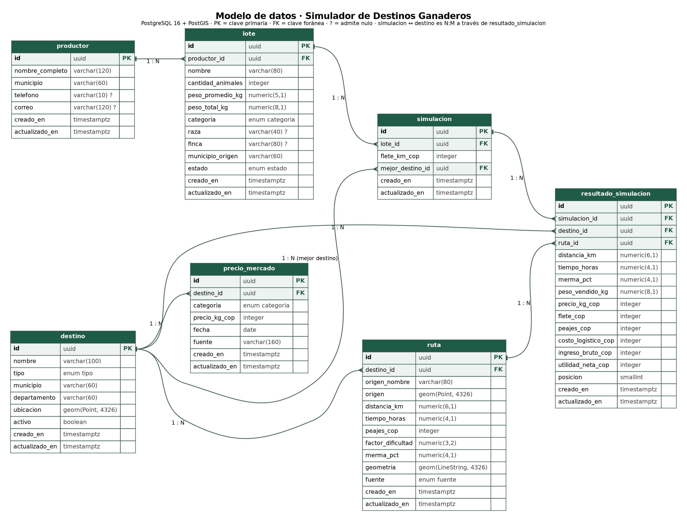

# Modelo de datos

Simulador de Destinos Ganaderos desde Yopal · Entrega 2 · versión 0.2.0

Este documento y `api/openapi.yaml` describen las mismas entidades con los mismos nombres de campo. Si se cambia uno, se cambia el otro en el mismo pull request.



## Motor elegido: PostgreSQL 16 con PostGIS 3

1. El problema es territorial: destinos y rutas son geometrías (`Point`, `LineString`) y la API necesita filtros espaciales como «destinos a menos de 300 km de Yopal» (`ST_DWithin`) y devolver GeoJSON directamente (`ST_AsGeoJSON`). PostGIS es el estándar para eso y es la tecnología central de la Ruta H.
2. Los datos son fuertemente relacionales: una simulación pertenece a un lote, genera un resultado por destino, y cada resultado apunta a un destino y a una ruta. Las claves foráneas y las transacciones garantizan que no quede un resultado huérfano ni una simulación a medio guardar.
3. Permite columnas generadas (`peso_total_kg`) y restricciones `CHECK`, así que las reglas del lote se validan también en la base, no solo en la API.

Se descartó MongoDB: tiene índices geoespaciales, pero el historial de simulaciones exige integridad referencial entre cuatro colecciones, que en MongoDB quedaría a cargo del código.

## Convenciones

- Nombres de tablas y columnas en español, en singular y en `snake_case`.
- Claves primarias `uuid` generadas con `gen_random_uuid()`. No se exponen identificadores secuenciales en la API.
- Toda entidad tiene `creado_en` y `actualizado_en` (`timestamptz`, por defecto `now()`); `actualizado_en` lo mantiene un disparador.
- Dinero en pesos colombianos como `integer` (sin decimales). Pesos en kilogramos como `numeric`.
- Geometrías en SRID 4326 (WGS 84), el mismo de GeoJSON.

Tipos enumerados (se crean como `CREATE TYPE ... AS ENUM`):

| Tipo | Valores |
|---|---|
| `categoria_animal` | `novillo_gordo`, `vaca_gorda`, `novillo_levante`, `ternero_destete`, `toro` |
| `estado_lote` | `disponible`, `simulado`, `vendido` |
| `tipo_destino` | `subasta`, `feria`, `frigorifico`, `planta_beneficio` |
| `fuente_ruta` | `osrm`, `manual`, `respaldo_linea_recta` |

## Entidades

### productor

Persona que registra lotes para vender.

| Campo | Tipo | Nulo | Por defecto | Restricciones |
|---|---|---|---|---|
| `id` | uuid | no | `gen_random_uuid()` | PK |
| `nombre_completo` | varchar(120) | no | | longitud ≥ 3 |
| `municipio` | varchar(60) | no | | |
| `telefono` | varchar(10) | sí | `NULL` | `^3[0-9]{9}$` (celular colombiano) |
| `correo` | varchar(120) | sí | `NULL` | único cuando no es nulo |
| `creado_en` | timestamptz | no | `now()` | |
| `actualizado_en` | timestamptz | no | `now()` | |

### lote

Grupo de animales de una misma categoría que el productor quiere comercializar.

| Campo | Tipo | Nulo | Por defecto | Restricciones |
|---|---|---|---|---|
| `id` | uuid | no | `gen_random_uuid()` | PK |
| `productor_id` | uuid | no | | FK → `productor.id`, `ON DELETE RESTRICT` |
| `nombre` | varchar(80) | no | | longitud ≥ 3 |
| `cantidad_animales` | integer | no | | `CHECK (cantidad_animales BETWEEN 1 AND 200)` |
| `peso_promedio_kg` | numeric(5,1) | no | | `CHECK (peso_promedio_kg BETWEEN 80 AND 900)` |
| `peso_total_kg` | numeric(8,1) | no | generado | `GENERATED ALWAYS AS (cantidad_animales * peso_promedio_kg) STORED` |
| `categoria` | categoria_animal | no | | |
| `raza` | varchar(40) | sí | `NULL` | |
| `finca` | varchar(80) | sí | `NULL` | |
| `municipio_origen` | varchar(60) | no | | |
| `estado` | estado_lote | no | `'disponible'` | pasa a `simulado` con la primera simulación |
| `creado_en` | timestamptz | no | `now()` | |
| `actualizado_en` | timestamptz | no | `now()` | |

El límite de 200 animales corresponde a varios camiones ganaderos; un lote más grande se divide.

### destino

Lugar donde se puede vender el lote: subasta, feria, frigorífico o planta de beneficio.

| Campo | Tipo | Nulo | Por defecto | Restricciones |
|---|---|---|---|---|
| `id` | uuid | no | `gen_random_uuid()` | PK |
| `nombre` | varchar(100) | no | | único |
| `tipo` | tipo_destino | no | | |
| `municipio` | varchar(60) | no | | |
| `departamento` | varchar(60) | no | | |
| `ubicacion` | geometry(Point, 4326) | no | | se expone como GeoJSON `Point` |
| `activo` | boolean | no | `true` | los inactivos no se ofrecen en el formulario |
| `creado_en` | timestamptz | no | `now()` | |
| `actualizado_en` | timestamptz | no | `now()` | |

### precio_mercado

Precio que paga un destino por kilogramo en pie, por categoría y por día. Se guarda un registro por fecha para conservar el histórico.

| Campo | Tipo | Nulo | Por defecto | Restricciones |
|---|---|---|---|---|
| `id` | uuid | no | `gen_random_uuid()` | PK |
| `destino_id` | uuid | no | | FK → `destino.id`, `ON DELETE CASCADE` |
| `categoria` | categoria_animal | no | | |
| `precio_kg_cop` | integer | no | | `CHECK (precio_kg_cop BETWEEN 3000 AND 30000)` |
| `fecha` | date | no | | |
| `fuente` | varchar(160) | no | | de dónde salió el dato (portal, llamada, boletín) |
| `creado_en` | timestamptz | no | `now()` | |
| `actualizado_en` | timestamptz | no | `now()` | |

Restricción única: `(destino_id, categoria, fecha)`. El «precio vigente» es el de fecha más reciente.

### ruta

Trayecto vial desde el origen hasta un destino.

| Campo | Tipo | Nulo | Por defecto | Restricciones |
|---|---|---|---|---|
| `id` | uuid | no | `gen_random_uuid()` | PK |
| `destino_id` | uuid | no | | FK → `destino.id`, `ON DELETE CASCADE` |
| `origen_nombre` | varchar(80) | no | `'Yopal (centro de acopio)'` | |
| `origen` | geometry(Point, 4326) | no | | |
| `distancia_km` | numeric(6,1) | no | | `CHECK (distancia_km BETWEEN 0 AND 3000)` |
| `tiempo_horas` | numeric(4,1) | no | | `CHECK (tiempo_horas BETWEEN 0 AND 72)` |
| `peajes_cop` | integer | no | `0` | `CHECK (peajes_cop >= 0)` |
| `factor_dificultad` | numeric(3,2) | no | `1.00` | `CHECK (factor_dificultad BETWEEN 1 AND 2)` |
| `merma_pct` | numeric(4,1) | no | `0` | `CHECK (merma_pct BETWEEN 0 AND 15)` |
| `geometria` | geometry(LineString, 4326) | no | | se expone como GeoJSON `LineString` |
| `fuente` | fuente_ruta | no | `'manual'` | |
| `creado_en` | timestamptz | no | `now()` | |
| `actualizado_en` | timestamptz | no | `now()` | |

Restricción única: `(destino_id, origen_nombre)`: una ruta por destino desde cada origen.

### simulacion

Una comparación de destinos para un lote con un valor de flete.

| Campo | Tipo | Nulo | Por defecto | Restricciones |
|---|---|---|---|---|
| `id` | uuid | no | `gen_random_uuid()` | PK |
| `lote_id` | uuid | no | | FK → `lote.id`, `ON DELETE RESTRICT` |
| `flete_km_cop` | integer | no | | `CHECK (flete_km_cop BETWEEN 1000 AND 50000)` |
| `mejor_destino_id` | uuid | no | | FK → `destino.id` (el resultado con `posicion = 1`) |
| `creado_en` | timestamptz | no | `now()` | fecha de la simulación |
| `actualizado_en` | timestamptz | no | `now()` | |

### resultado_simulacion

Una fila por destino comparado. Guarda una copia de los valores usados en el cálculo.

| Campo | Tipo | Nulo | Por defecto | Restricciones |
|---|---|---|---|---|
| `id` | uuid | no | `gen_random_uuid()` | PK |
| `simulacion_id` | uuid | no | | FK → `simulacion.id`, `ON DELETE CASCADE` |
| `destino_id` | uuid | no | | FK → `destino.id` |
| `ruta_id` | uuid | no | | FK → `ruta.id` |
| `distancia_km` | numeric(6,1) | no | | copia de `ruta.distancia_km` |
| `tiempo_horas` | numeric(4,1) | no | | copia de `ruta.tiempo_horas` |
| `merma_pct` | numeric(4,1) | no | | copia de `ruta.merma_pct` |
| `peso_vendido_kg` | numeric(8,1) | no | | `peso_total_kg × (1 − merma_pct/100)` |
| `precio_kg_cop` | integer | no | | precio vigente al momento de simular |
| `flete_cop` | integer | no | | `distancia_km × flete_km_cop × factor_dificultad` |
| `peajes_cop` | integer | no | | copia de `ruta.peajes_cop` |
| `costo_logistico_cop` | integer | no | | `flete_cop + peajes_cop` |
| `ingreso_bruto_cop` | integer | no | | `peso_vendido_kg × precio_kg_cop` |
| `utilidad_neta_cop` | integer | no | | `ingreso_bruto_cop − costo_logistico_cop` (puede ser negativa) |
| `posicion` | smallint | no | | `CHECK (posicion >= 1)`; 1 = mayor utilidad |
| `creado_en` | timestamptz | no | `now()` | |
| `actualizado_en` | timestamptz | no | `now()` | |

Restricciones únicas: `(simulacion_id, destino_id)` y `(simulacion_id, posicion)`.

## Relaciones

| Relación | Cardinalidad | Clave foránea |
|---|---|---|
| productor → lote | uno a muchos | `lote.productor_id` |
| lote → simulacion | uno a muchos | `simulacion.lote_id` |
| destino → precio_mercado | uno a muchos | `precio_mercado.destino_id` |
| destino → ruta | uno a muchos (una por origen) | `ruta.destino_id` |
| simulacion → resultado_simulacion | uno a muchos | `resultado_simulacion.simulacion_id` |
| simulacion ↔ destino | muchos a muchos, resuelta por `resultado_simulacion` | `resultado_simulacion.destino_id` |
| ruta → resultado_simulacion | uno a muchos | `resultado_simulacion.ruta_id` |
| destino → simulacion (mejor destino) | uno a muchos | `simulacion.mejor_destino_id` |

## Índices

| Índice | Tabla | Por qué |
|---|---|---|
| `lote_productor_idx (productor_id)` | lote | `GET /lotes?productor_id=` y el `JOIN` con productor. |
| `lote_estado_categoria_idx (estado, categoria)` | lote | Filtros del listado de lotes. |
| `lote_creado_idx (creado_en DESC)` | lote | Orden por defecto del listado (`-creado_en`). |
| `productor_correo_uq (correo) WHERE correo IS NOT NULL` | productor | Evita correos repetidos sin obligar a tener correo. |
| `productor_municipio_idx (municipio)` | productor | `GET /productores?municipio=`. |
| `destino_ubicacion_gix USING GIST (ubicacion)` | destino | Filtro espacial `ST_DWithin` de `GET /destinos?cerca_lat=&cerca_lon=&radio_km=`. |
| `destino_tipo_idx (tipo)`, `destino_departamento_idx (departamento)` | destino | Filtros `tipo` y `departamento`. |
| `precio_destino_cat_fecha_uq (destino_id, categoria, fecha DESC)` | precio_mercado | Unicidad y búsqueda del precio vigente sin ordenar toda la tabla. |
| `ruta_destino_origen_uq (destino_id, origen_nombre)` | ruta | Unicidad y `GET /rutas?destino_id=`. |
| `ruta_geometria_gix USING GIST (geometria)` | ruta | Consultas espaciales sobre trayectos y teselas vectoriales (Entrega 5). |
| `simulacion_lote_fecha_idx (lote_id, creado_en DESC)` | simulacion | Historial por lote, de la más reciente a la más antigua. |
| `resultado_sim_posicion_uq (simulacion_id, posicion)` | resultado_simulacion | Devolver los resultados ya ordenados. |

## Correspondencia con el contrato de API

| Esquema OpenAPI | Tabla | Notas |
|---|---|---|
| `Productor`, `ProductorEntrada` | productor | mismos campos |
| `Lote`, `LoteEntrada`, `LoteCambios` | lote | `peso_total_kg` es de solo lectura (columna generada) |
| `Destino` | destino | `ubicacion` viaja como GeoJSON `Point` |
| `PrecioMercado`, `PrecioMercadoEntrada` | precio_mercado | `destino_id` llega por la ruta `/destinos/{destino_id}/precios` |
| `Ruta` | ruta | `origen` y `geometria` viajan como GeoJSON |
| `Simulacion`, `SimulacionEntrada` | simulacion | ver campos que no son columnas |
| `ResultadoSimulacion` | resultado_simulacion | mismos campos |

Campos del contrato que no son columnas, y dónde viven:

- `SimulacionEntrada.destino_ids`: lista de entrada; cada elemento se guarda como una fila de `resultado_simulacion.destino_id`.
- `Simulacion.resultados`: las filas de `resultado_simulacion` de esa simulación, ordenadas por `posicion`.

## Decisiones del modelo

- **Los resultados guardan copia de distancia, precio, peajes y merma.** Si mañana cambia el precio del frigorífico, una simulación del 14 de septiembre debe seguir mostrando el precio con el que se decidió. Por eso no se recalcula al consultar el historial.
- **No hay campo de versión.** Los resultados no se editan, se crean simulaciones nuevas; y el precio se historiza por fecha. No hay edición concurrente que requiera bloqueo optimista en esta versión.
- **La merma se modela en la ruta.** Depende sobre todo de las horas de viaje, que son propiedad del trayecto. Los valores actuales son estimaciones del equipo y deben validarse con ganaderos (pendiente en `decisiones.md`).
- **Sin usuarios todavía.** La autenticación llega en la Entrega 3; entonces se agrega la tabla `usuario` y la relación usuario → productor, en el mismo pull request que actualice el contrato.

## Anexo: DDL de referencia para la Entrega 3

```sql
CREATE EXTENSION IF NOT EXISTS postgis;
CREATE EXTENSION IF NOT EXISTS pgcrypto;

CREATE TYPE categoria_animal AS ENUM ('novillo_gordo','vaca_gorda','novillo_levante','ternero_destete','toro');
CREATE TYPE estado_lote      AS ENUM ('disponible','simulado','vendido');
CREATE TYPE tipo_destino     AS ENUM ('subasta','feria','frigorifico','planta_beneficio');
CREATE TYPE fuente_ruta      AS ENUM ('osrm','manual','respaldo_linea_recta');

CREATE TABLE productor (
  id              uuid PRIMARY KEY DEFAULT gen_random_uuid(),
  nombre_completo varchar(120) NOT NULL CHECK (char_length(nombre_completo) >= 3),
  municipio       varchar(60)  NOT NULL,
  telefono        varchar(10)  CHECK (telefono ~ '^3[0-9]{9}$'),
  correo          varchar(120),
  creado_en       timestamptz  NOT NULL DEFAULT now(),
  actualizado_en  timestamptz  NOT NULL DEFAULT now()
);
CREATE UNIQUE INDEX productor_correo_uq ON productor (correo) WHERE correo IS NOT NULL;
CREATE INDEX productor_municipio_idx ON productor (municipio);

CREATE TABLE lote (
  id                uuid PRIMARY KEY DEFAULT gen_random_uuid(),
  productor_id      uuid NOT NULL REFERENCES productor(id) ON DELETE RESTRICT,
  nombre            varchar(80) NOT NULL CHECK (char_length(nombre) >= 3),
  cantidad_animales integer NOT NULL CHECK (cantidad_animales BETWEEN 1 AND 200),
  peso_promedio_kg  numeric(5,1) NOT NULL CHECK (peso_promedio_kg BETWEEN 80 AND 900),
  peso_total_kg     numeric(8,1) GENERATED ALWAYS AS (cantidad_animales * peso_promedio_kg) STORED,
  categoria         categoria_animal NOT NULL,
  raza              varchar(40),
  finca             varchar(80),
  municipio_origen  varchar(60) NOT NULL,
  estado            estado_lote NOT NULL DEFAULT 'disponible',
  creado_en         timestamptz NOT NULL DEFAULT now(),
  actualizado_en    timestamptz NOT NULL DEFAULT now()
);
CREATE INDEX lote_productor_idx        ON lote (productor_id);
CREATE INDEX lote_estado_categoria_idx ON lote (estado, categoria);
CREATE INDEX lote_creado_idx           ON lote (creado_en DESC);

CREATE TABLE destino (
  id             uuid PRIMARY KEY DEFAULT gen_random_uuid(),
  nombre         varchar(100) NOT NULL UNIQUE,
  tipo           tipo_destino NOT NULL,
  municipio      varchar(60)  NOT NULL,
  departamento   varchar(60)  NOT NULL,
  ubicacion      geometry(Point, 4326) NOT NULL,
  activo         boolean NOT NULL DEFAULT true,
  creado_en      timestamptz NOT NULL DEFAULT now(),
  actualizado_en timestamptz NOT NULL DEFAULT now()
);
CREATE INDEX destino_ubicacion_gix    ON destino USING GIST (ubicacion);
CREATE INDEX destino_tipo_idx         ON destino (tipo);
CREATE INDEX destino_departamento_idx ON destino (departamento);

CREATE TABLE precio_mercado (
  id             uuid PRIMARY KEY DEFAULT gen_random_uuid(),
  destino_id     uuid NOT NULL REFERENCES destino(id) ON DELETE CASCADE,
  categoria      categoria_animal NOT NULL,
  precio_kg_cop  integer NOT NULL CHECK (precio_kg_cop BETWEEN 3000 AND 30000),
  fecha          date NOT NULL,
  fuente         varchar(160) NOT NULL,
  creado_en      timestamptz NOT NULL DEFAULT now(),
  actualizado_en timestamptz NOT NULL DEFAULT now()
);
CREATE UNIQUE INDEX precio_destino_cat_fecha_uq ON precio_mercado (destino_id, categoria, fecha DESC);

CREATE TABLE ruta (
  id                uuid PRIMARY KEY DEFAULT gen_random_uuid(),
  destino_id        uuid NOT NULL REFERENCES destino(id) ON DELETE CASCADE,
  origen_nombre     varchar(80) NOT NULL DEFAULT 'Yopal (centro de acopio)',
  origen            geometry(Point, 4326) NOT NULL,
  distancia_km      numeric(6,1) NOT NULL CHECK (distancia_km BETWEEN 0 AND 3000),
  tiempo_horas      numeric(4,1) NOT NULL CHECK (tiempo_horas BETWEEN 0 AND 72),
  peajes_cop        integer NOT NULL DEFAULT 0 CHECK (peajes_cop >= 0),
  factor_dificultad numeric(3,2) NOT NULL DEFAULT 1.00 CHECK (factor_dificultad BETWEEN 1 AND 2),
  merma_pct         numeric(4,1) NOT NULL DEFAULT 0 CHECK (merma_pct BETWEEN 0 AND 15),
  geometria         geometry(LineString, 4326) NOT NULL,
  fuente            fuente_ruta NOT NULL DEFAULT 'manual',
  creado_en         timestamptz NOT NULL DEFAULT now(),
  actualizado_en    timestamptz NOT NULL DEFAULT now()
);
CREATE UNIQUE INDEX ruta_destino_origen_uq ON ruta (destino_id, origen_nombre);
CREATE INDEX ruta_geometria_gix ON ruta USING GIST (geometria);

CREATE TABLE simulacion (
  id               uuid PRIMARY KEY DEFAULT gen_random_uuid(),
  lote_id          uuid NOT NULL REFERENCES lote(id) ON DELETE RESTRICT,
  flete_km_cop     integer NOT NULL CHECK (flete_km_cop BETWEEN 1000 AND 50000),
  mejor_destino_id uuid NOT NULL REFERENCES destino(id),
  creado_en        timestamptz NOT NULL DEFAULT now(),
  actualizado_en   timestamptz NOT NULL DEFAULT now()
);
CREATE INDEX simulacion_lote_fecha_idx ON simulacion (lote_id, creado_en DESC);

CREATE TABLE resultado_simulacion (
  id                  uuid PRIMARY KEY DEFAULT gen_random_uuid(),
  simulacion_id       uuid NOT NULL REFERENCES simulacion(id) ON DELETE CASCADE,
  destino_id          uuid NOT NULL REFERENCES destino(id),
  ruta_id             uuid NOT NULL REFERENCES ruta(id),
  distancia_km        numeric(6,1) NOT NULL,
  tiempo_horas        numeric(4,1) NOT NULL,
  merma_pct           numeric(4,1) NOT NULL,
  peso_vendido_kg     numeric(8,1) NOT NULL,
  precio_kg_cop       integer NOT NULL,
  flete_cop           integer NOT NULL,
  peajes_cop          integer NOT NULL,
  costo_logistico_cop integer NOT NULL,
  ingreso_bruto_cop   integer NOT NULL,
  utilidad_neta_cop   integer NOT NULL,
  posicion            smallint NOT NULL CHECK (posicion >= 1),
  creado_en           timestamptz NOT NULL DEFAULT now(),
  actualizado_en      timestamptz NOT NULL DEFAULT now(),
  UNIQUE (simulacion_id, destino_id)
);
CREATE UNIQUE INDEX resultado_sim_posicion_uq ON resultado_simulacion (simulacion_id, posicion);
```
